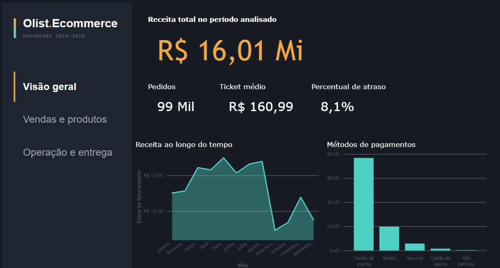
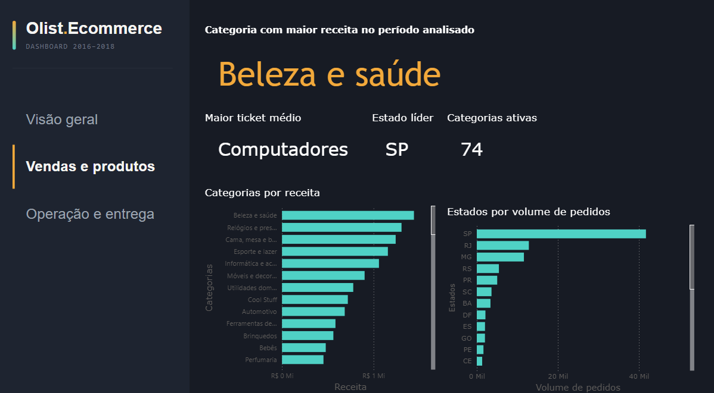
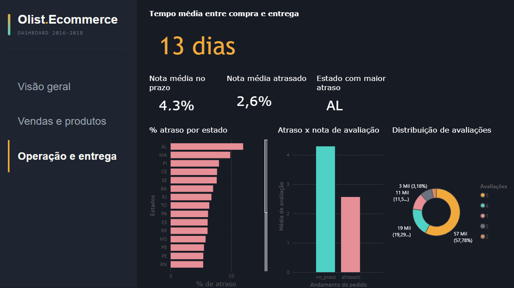

# 📊 Análise de E-commerce — Olist Brasil

Projeto de **análise de dados de um marketplace brasileiro**, desenvolvido a partir do dataset público **Olist Brazilian E-Commerce**, com dados de pedidos realizados entre **2016 e 2018**.

O projeto simula um cenário real de análise de negócio, passando pela **exploração e validação dos dados, modelagem em banco SQLite, criação de consultas SQL e desenvolvimento de um dashboard interativo no Power BI**.

---

## Objetivo

Transformar dados transacionais de um e-commerce em **informações relevantes para tomada de decisão**, respondendo perguntas relacionadas a:

* Evolução das vendas e da receita
* Desempenho das categorias de produtos
* Distribuição geográfica das vendas
* Comportamento e métodos de pagamento
* Desempenho logístico e tempo de entrega
* Taxa de pedidos atrasados
* Relação entre atraso na entrega e satisfação do cliente
* Ticket médio e desempenho comercial

---

## Dados

O projeto utiliza os **9 arquivos CSV** disponibilizados pelo dataset Olist:

* `customers` — informações dos clientes
* `orders` — pedidos e seus status
* `order_items` — itens dos pedidos
* `order_payments` — informações de pagamento
* `order_reviews` — avaliações dos clientes
* `products` — informações dos produtos
* `sellers` — vendedores
* `geolocation` — dados geográficos
* `product_category_name_translation` — tradução das categorias

Os arquivos foram integrados e armazenados em um banco **SQLite (`olist_ecommerce.db`)**, posteriormente conectado ao Power BI por meio de **ODBC**.

---

## Tecnologias utilizadas

* **SQLite** — armazenamento e consulta dos dados
* **SQL** — exploração, validação e análise dos dados
* **Power BI** — visualização e construção do dashboard
* **DAX** — criação de métricas e indicadores
* **HTML/CSS** — personalização da navegação do dashboard
* **Git/GitHub** — versionamento e documentação do projeto

---

## Análise SQL

As consultas SQL foram organizadas em **três camadas**, separando exploração, análise de negócio e análises complementares.

### 01. Exploração e validação

Consultas utilizadas para compreender a estrutura e a qualidade dos dados:

* Contagem de registros
* Período analisado
* Distribuição dos pedidos por status
* Distribuição das avaliações
* Verificação de consistência dos dados

### 02. Análise de negócio

Consultas direcionadas à geração de insights:

* Receita ao longo do tempo
* Categorias com maior desempenho
* Estados com maior volume de vendas
* Taxa de pedidos atrasados
* Relação entre atraso e avaliação
* Distribuição dos métodos de pagamento

### 03. Análises complementares

Métricas adicionais para aprofundar a análise:

* Ticket médio por categoria
* Tempo médio de entrega
* Atrasos por estado
* Desempenho logístico
* Indicadores de satisfação

Ao todo, o projeto conta com **18+ consultas SQL**.

---

## 📊 Dashboard

O dashboard foi desenvolvido no **Power BI**, com identidade visual própria, utilizando **tema escuro, navegação lateral personalizada, tipografia customizada e elementos em HTML/CSS**.

### Visão Geral

Apresenta os principais indicadores do marketplace e a evolução da receita ao longo do período analisado.

**Principais indicadores:**

* Receita
* Número de pedidos
* Ticket médio
* Avaliação média
* Evolução das vendas

### Vendas e Produtos

Analisa o desempenho comercial e a distribuição das vendas:

* Categorias mais relevantes
* Ticket médio por categoria
* Distribuição geográfica
* Desempenho das vendas

### Operação e Entrega

Foco na eficiência logística e na experiência do cliente:

* Tempo médio de entrega
* Taxa de atraso
* Atrasos por estado
* Relação entre atraso e avaliação
* Impacto da logística na satisfação

---

## 📸 Dashboard

## Principais perguntas de negócio

O projeto foi construído para responder questões como:

**Vendas**

* Como a receita evoluiu ao longo do tempo?
* Quais categorias apresentam maior desempenho?
* Quais estados concentram maior volume de vendas?

**Clientes**

* Como os clientes avaliam suas compras?
* Existe relação entre experiência de entrega e satisfação?

**Logística**

* Qual é o tempo médio de entrega?
* Qual a taxa de pedidos atrasados?
* Quais estados apresentam maior incidência de atrasos?

**Pagamento**

* Quais métodos de pagamento são mais utilizados?
* Como os pagamentos estão distribuídos entre os pedidos?

---

## Conclusão

Este projeto demonstra a aplicação de um **pipeline de análise de dados ponta a ponta**, desde a organização e exploração dos dados até a transformação das informações em indicadores e visualizações para suporte à tomada de decisão.

A combinação de **SQL + SQLite + Power BI** permitiu estruturar os dados, realizar análises de negócio e construir uma solução de BI capaz de apresentar os principais resultados de forma clara e interativa.

---

## Autora

**Heloísa Torres Oliveira**
